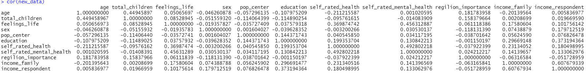
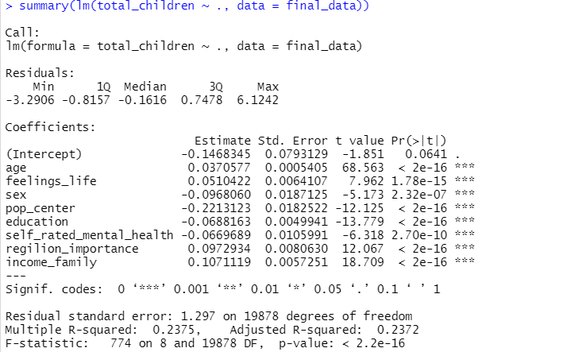
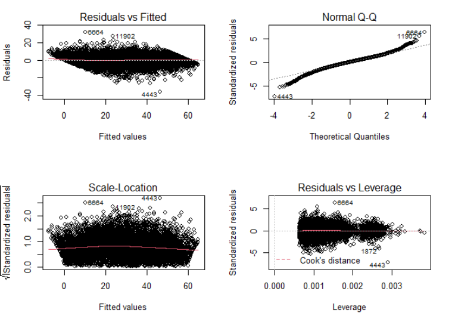

```{r setup, include=FALSE}
knitr::opts_chunk$set(echo = FALSE)
```

## The analysis of fertility and its potential influencing factors in Canada

# Zhipeng Zhou 
# Oct 19, 2020

## Abstract

Here is where you give a brief (one paragraph overview of your entire paper). This should include some background/introduction, some methodology, results and conclusions.

## Introduction

Due to the COVID-19 pandemic, according to the CBC news, it may lower Canada's already declining birth rate [1]. The reasons are obvious. Stability, security, predictability all impact fertility intentions and the COVID-19 pandemic just has a great impact on those factors. However, the words -- "already declining" -- are very interesting, since Stability, security, predictability will impact fertility intentions. However, before the pandemic, it's hard to say the world became better, but the social environment becomes more and more stable. And in this condition, the birth rate was still decreasing. Why that happened? There are many discussions already, like "4 contributing factors to declining fertility rates" from Lauren Arcuri [2]. But most of them are theoretical and rarely based on real world data. So in this report, I'm going to analysis the fertility and its potential influencing factors based on the data from Canadian General Social Survey (GSS).

In the following report, I will first introduce how I collected and processed the data. And do some analysis about the data on the processed data later. Then I will use those data to try to build a statistical model (a multiple regression model) to explain the data and the relationship between fertility and its potential influencing factors. In the end, I will give a summary and reflection about my model and report and point the direction of further study.

Code and data supporting this analysis is available at: X
\newpage
## Data

Since the topic about my report is discussing the fertility and its potential influencing factors in Canada, then I use the General Social Survey (GSS) [3] as my source of data. It provides me relatively fair, real and reliable data. More important, the data in GSS is well-organized and sorted. So it makes my work easier. Due to my analysis purpose, I chose the most recent data (2017) and download from the database. From the downloaded data, there are 81 variables with 20602 observation objects. So the sampling frame is all Canadians. But obviously, some variables are not going to be used, since they are not quite related to our goal (the fertility). Then we just pick some interesting potential values to discuss. In this analysis, we include age, total number of children, feelings of life, sex, pop living center, education level, self mental health, religion importance, and family income as our data set.

The reason why age is included in variables is, the life concept may affect the fertility intention, since different generation always have different ways of thinking. The feeling of live, self mental health rate, and family reflect the expectations for the life, which may also influence the fertility intention. However, the respondent's income and the self health rate were also included. Through calculate the correlation of variables (Figure 1), we found those two variables have high correlation with other variables, which means they are not relatively independent. So we removed them from variables eventually. 



And according the report from Junho Kim [4], we know that the negative correlation between women’s education and fertility is a common phenomenon. So gender and education level are also included. And since we only focus on the Canadian fertility this time, we also include the pop living center. In that condition, we can analyze the relationship between fertility intention and the living place.

The another reason why I choose those variables is they are comparable. Since not all variables are numeric. Some of them are categorical, which makes hard to transfer them to numeric. Because to apply a model on them, we need to transfer all data to numeric. If the categorical variables are comparable, them we can transfer them directly according to their degree. For example, we can set the variable of whose family income less than 25,000 as 1 and 25,000 to 49,000 as 2, and so on. But there are still problems, since we don't know whether it is linear or not. Obviously, 1,000 dollars and 10,000 dollars have great difference on a family, but for $10^{11}$ and $10^{12}$ dollars, maybe the difference is not that important for living.

Furthermore, some of those data are useless, due to missing values. The observations with missing values are hard to handle, so in this analysis we just remove the observations with missing values by using is.na function in R. Therefore, the sample population is the group of Canadian who participate the survey and have no missing data.

And eventually, we have 19887 observations with 11 variables in our data set.

\newpage
## Model

$$Y=-0.147 +0.037X_1+0.051X_2-0.097X_3-0.221X_4-0.069X_5-0.027X_6+0.097X_7+0.107X_8$$
$Y$ represents the number of children the observation has, which is non negative.

$X_1$ represents the age of the observation, which is non negative.

$X_2$ represents the feeling of life of the observation has, which can be rated in range $[0,10]$.

$X_3$ represents the gender of the observation, with 1 is male and 0 is female.

$X_4$ represents the living place of the observation. 1 is Prince Edward Island, 2 is Rural areas and small population centres, and 3 is Larger urban population centres (CMA/CA).

$X_5$ represents the education level of the observation. From 1 to 7, the education level getting higher.

$X_6$ represents the self mental health rate of the observation. From 0 to 5, the higher the better.

$X_7$ represents the importance of religion of the observation. From 0 to 4, it becomes more important.

$X_8$ represents the family income of the observation. From 1 to 6, the higher the better.


It is a multiple regression model, with the number of children the observation has as the dependent variable and all other 8 data as independent variable. According to the model, we can find that the number of children is positive correlated with the age, the feeling of life, the religion importance and the family income, which means the earlier the generation of a person live, the more money his/her family has and the more importance of religion, then he/she may have a stronger fertility intentions.

On the contrary, the number of children has a negative relationships between gender, living place, education level and self mental health rate. So the female with high education level does have a lower fertility intention. And compared with male, female participants have a low rate of having more children.

## Results

Then to analysis the model we build, here I introduce symmary() and lm() function in R. lm() helps us to fit the linear models and symmery() is used to analysis the model we build.



From the output of summary(), we can find that all variables have a close relationship with the independent variable (the number of children the observation has), since all variables followed by "***". The more star it has, the closer related to the independent variable. And the result can also been got from P-value and t-value.

From the multiple R-squared value, we can find that the value is only 0.24, which is relatively low. However, we are considering and building model for human behaviour which is totally unpredictable. So 0.24 is still acceptable. But that also means we may need to take more situations into consideration.

Although our model passed the t-test and F-test, we also need to test whether our model is meaningful or not, since the linear regression model is based on the five following assumption, Normal i.i.d. errors, Constant error variance, Absence of influential cases, Linear relationship between predictors and outcome variable, and Collinearity. To test those assumption we can use plot() function to plot Residuals vs Fitted, Normal QQ, Scale-Location, and Residuals Leverage to test. And the result show in Figure 3,



In those four model, we can find one problem. There are linear relationships exist in Residuals vs Fitted and all other three plots are good to go. The reason why it happened may because some of independent variables are not continuous. As the definition I mentioned above, except age, all other seven variables are not linear.

But as a result, we can say that the model we build is still useful, even though we still have a lot of room for improvement.

\newpage
## Discussion

Here you will discuss conclusions drawn from the results and comment on how it relates to the original goal of the study (which was specified in the Introduction).

# Weaknesses

Here we discuss weaknesses of the study, data, analysis, etc. You can also discuss areas for improvement.

# Next Steps

Here you discuss subsequent work to be done after this report. This can include next steps in terms of statistical analysis (perhaps there is a more efficient algorithm available, or perhaps there is a caveat in the data that would allow for some new technique). Future steps should also be specified in terms of the study setting (eg. including a follow-up survey on something, or a subsequent study that would complement the conclusions of your report).


## References
[1] The COVID-19 pandemic is expected to lower the birth rate. Here's why that matters | CBC news. (2019, October 23). CBC. https://www.cbc.ca/news/health/covid-19-birthrate-1.5670539

[2] 4 contributing factors to declining fertility rates. (n.d.). Empowered Women's Health. https://www.volusonclub.net/empowered-womens-health/4-contributing-factors-to-declining-fertility-rates-a-global-overview/

[3] Computing in the Humanities and Social Sciences. https://www.chass.utoronto.ca/

[4] Jungho Kim. (2016). Female education and its impact on fertility. IZA World of Labor. https://wol.iza.org/uploads/articles/228/pdfs/female-education-and-its-impact-on-fertility.pdf

